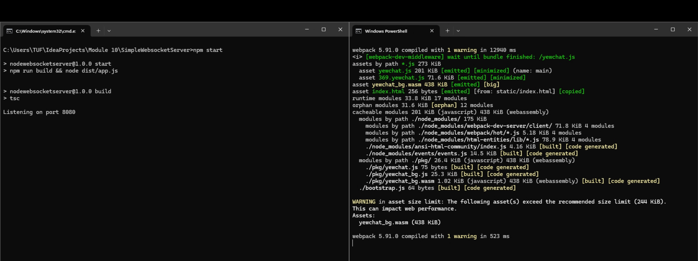
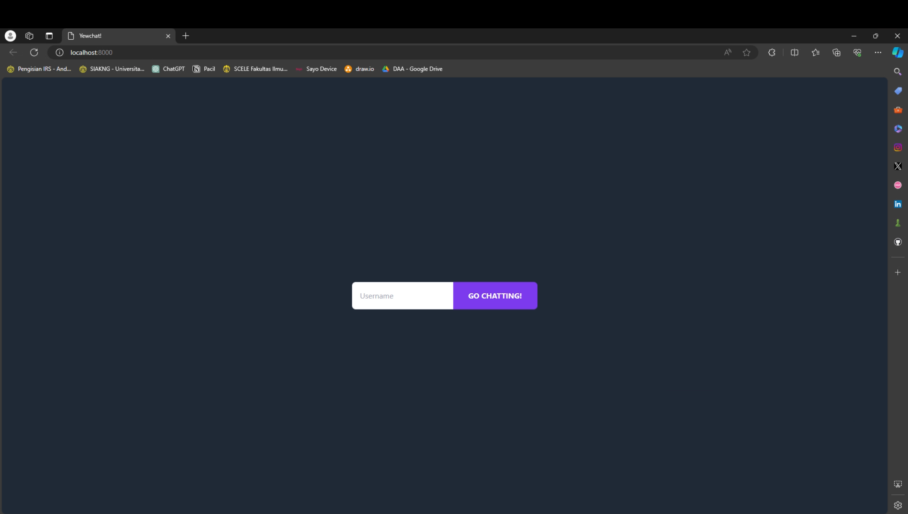
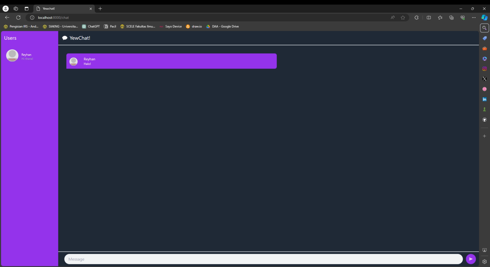
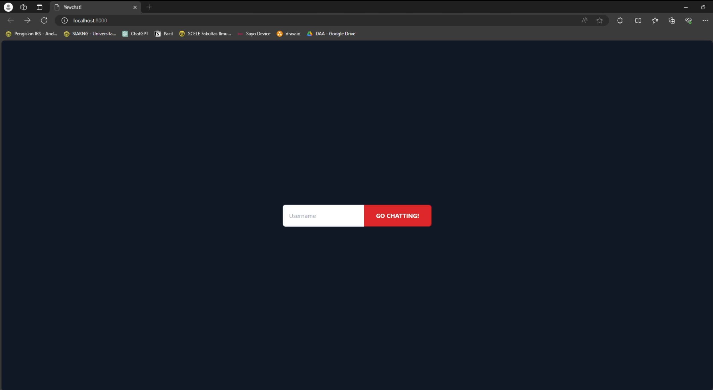
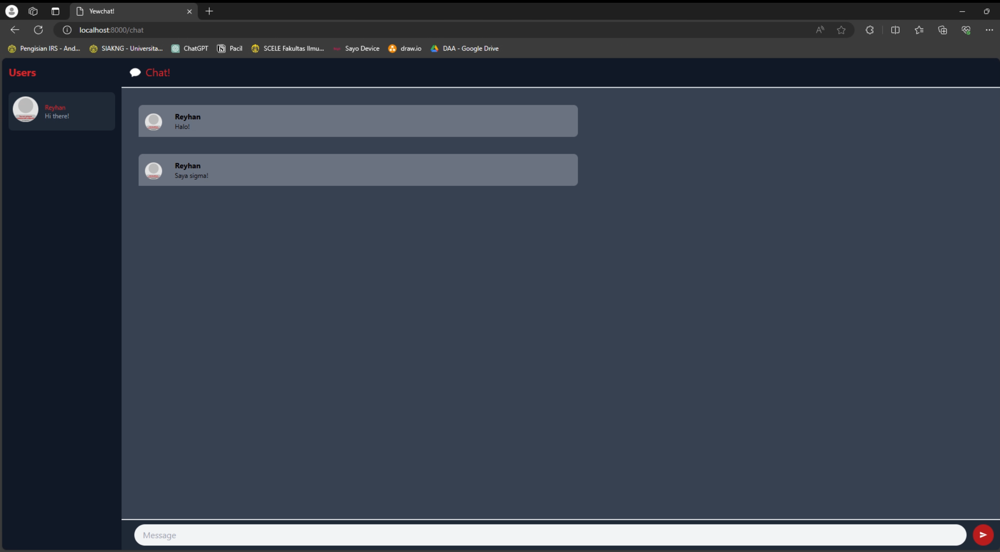

# Advanced Programming - Module 10
#### Reyhan Zada Virgiwibowo - 2206081723 - Advanced Programming C

### 3.1 Original code

Terminal

Login

Chat

### 3.2 Be Creative!

Login

Chat

Explanation : Untuk kreatifitas, saya mengubah warna tema dari keseluruhan aplikasi menjadi dominan merah dan abu gelap. Perubahan ini saya lakukan dengan memodifikasi html yang di return pada file `login.rs` dan `chat.rs`.

